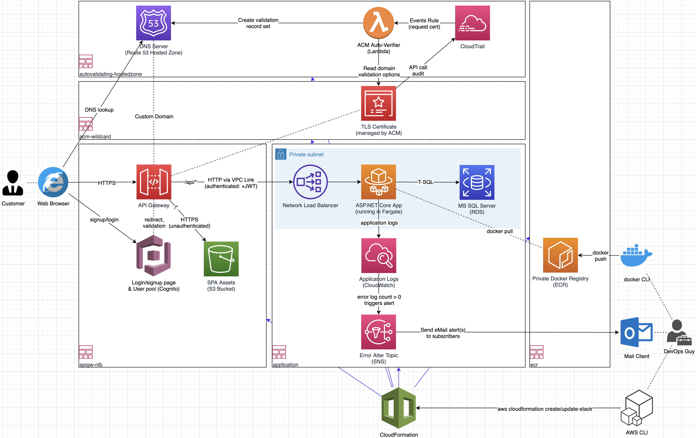

# .NET Core goes AWS Fargate

## What is this?

- Focus ("everything else are side dishes"): An AWS CloudFormation template that allows you to run a dockerized ASP.NET core application in ECS Fargate with a MS SQL Server RDS backend and a (hosted) Cognito Login Page (see cf/*.yaml)
- Sample workload: A simple ASP.NET Core hello world app that talks to MS SQL Server and logs in "CloudWatch Logs Insights-friendly" JSON
- A couple of (bash-) scripts so that you do not have to leave the console

## Overview

## AWS stuff covered

- CloudFormation: Infrastructure-as-Code
- Application Load Balancer (ALB): Managed HTTP reverse proxy with SSL termination
- AWS Fargate: Serverless compute for containers
- AWS Secrets Manager: Secure storage (e.g. for RDS credentials and connection strings with embedded secrets)
- Amazon ECR: Managed private docker registry
- Amazon RDS for SQL server: Managed MS SQL Server
- CloudWatch Logs: Managed Logging solution
- CloudWatch Logs Metric Filters: Used to convert error-logs to CloudWatch error metrics
- CloudWatch Alarms: Alarm based on the occurrence of errors in the logs
- Simple Notification Service: Used to send error alerts to email subscribers 
- Amazon Simple Queue Service: Process SQS messages via AWS SDK for .NET
- Route53: Managed DNS
- AWS Certificate Manager: Managed TLS cert for ALB, ALB integration
- Cognito: User Pool, hosted login/signup UI, ALB integration
- Cloud Watch Events Rule and Lambda: Used to auto-validate ACM certificates

## Preconditions

- AWS Account and default VPC (tested in eu-central-1)
- Linux-like OS (e.g. macOS - tested with Catalina)
- AWS CLI (v2 or the most recent v1) installed and profile configured (~admin permissions)
- Docker installed and running (e.g. Docker Desktop)
- Tools for everyday use installed (used in scripts): bash, sed, awk, curl, jq, ruby, uuidgen
- awslogs installed (pip3 install awslogs)
- Optional: Visual Studio Code and .NET Core plugins installed

## Steps

General tip (and disclaimer): Study all scripts (bash, ruby) and sources (C#) before you execute them. Basically they should work if all tools are installed and configured (see preconditions). 

Note, however, that the scripts (and obviously the app) are not intended for productive use (the scripts do not handle errors properly, among others).

Preparation:

    # Ensure you are targeting the correct AWS account
    export AWS_PROFILE=<your-aws-cli-profile>

    # Create SQS queue and update config in appsettings.Development.json (to run app in VS Code) and environment config in docker_run_app.sh (to run app with docker)
    ./create_sqs_queue_for_vscode_and_docker.sh

    # Update AWS profile in appsettings.Development.json
    ./update_vs_settings.sh 

    # Optional (show git branch in bash prompt)
    . ./mac_git_branch_ps1.sh

Run app in Visual Studio Code:

    # Start DB
    ./docker_run_db.sh

    # Run app
    F5

    # Test app
    open https://localhost:5001/WeatherForecast

Run app with docker:

    # Start DB
    ./docker_run_db.sh

    # Optional: Manually interact with DB
    ./docker_run_db_sqlcmd.sh

    # Build and run app
    ./docker_build.sh
    ./docker_run_app.sh

    # Test app
    ./curl_app.sh

Run app in AWS:

    # Create Route53 hosted zone and deploy ACM certificate auto-validation lambda
    ./create_stack_autovalidating_hostedzone.sh <your new DNS domain>

    # Manual step: update your domain name registrar's configuration (NS servers output from previous step)

    # Create wildcard SSL certificate (*.<your new DNS domain>)
    ./create_stack_acm.sh

    # Create private docker image repository (ECR)
    ./create_stack_ecr.sh
    
    # Create ALB, ECS cluster & task definition & service (desired count=0), RDS instance and Security Groups (in default VPC), etc.
    ./create_stack_application.sh

    # Optional: Subscribe to error log alerts
    ./topic_subscribe.sh <your-email>

    # Build .NET service and docker image, push image to ECR
    ./docker_build.sh
    ./ecr_dockerlogin.sh
    ./ecr_dockerpush.sh 

    # Set desired count to 1 ("deploy" dockerized .NET service)
    ./update_stack_application.sh

    # Send HTTP request to service
    ./curl_stack_application.sh
   
    # CloudWatch Logs Insighs sample: Show recent info logs (somewhat delayed)
    ./logs_insights_stack_application.sh

    # awslogs sample: "tail -f" error and critical logs
    ./logs_watch_stack_application.sh

    # Don't forget to delete all AWS resources after testing (to keep the AWS bill low)
    ./delete_stack_application.sh 
    ./delete_stack_ecr.sh

Enjoy!
